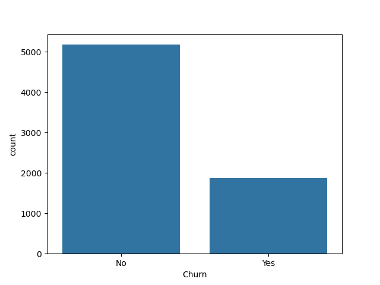
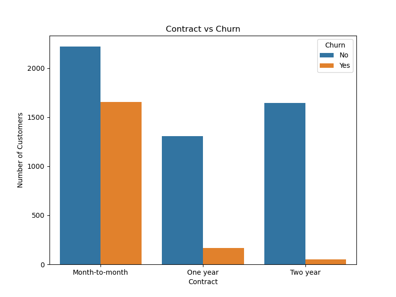
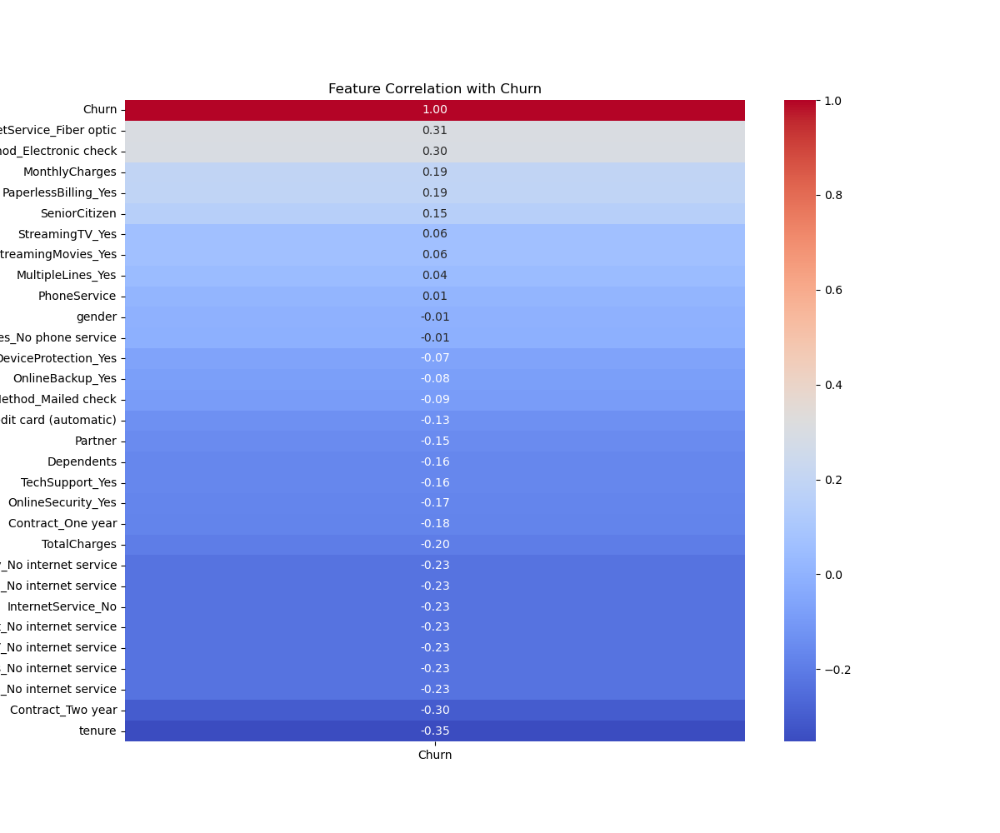

# 📊 Telco Customer Churn Prediction

## 📌 Project Overview

Telco Customer Churn Prediction is a Machine Learning project developed to predict whether a telecom customer is likely to churn or stay with the company.

The project performs data preprocessing, Exploratory Data Analysis (EDA), feature encoding, feature scaling, Machine Learning model training, model evaluation, and deployment using a Streamlit web application.

The application allows users to enter customer details and predicts whether the customer is likely to churn, along with the churn probability.

---

## 🎯 Objectives

- Predict telecom customer churn using Machine Learning.
- Clean and preprocess the dataset.
- Perform Exploratory Data Analysis (EDA).
- Encode categorical features.
- Scale numerical features.
- Train and compare classification models.
- Evaluate model performance.
- Build a Streamlit application for customer churn prediction.

---

## 📂 Dataset

The project uses the **Telco Customer Churn Dataset**.

The dataset contains customer information related to demographics, services, contracts, and billing.

### Main Features

- Gender
- Senior Citizen
- Partner
- Dependents
- Tenure
- Phone Service
- Multiple Lines
- Internet Service
- Online Security
- Online Backup
- Device Protection
- Tech Support
- Streaming TV
- Streaming Movies
- Contract
- Paperless Billing
- Payment Method
- Monthly Charges
- Total Charges

### Target Variable

**Churn**

- `0` → Customer stays
- `1` → Customer churns

---

## 🔧 Data Preprocessing

The following preprocessing steps were performed:

1. Loaded the dataset using Pandas.
2. Checked dataset shape and information.
3. Checked duplicate records.
4. Checked categorical feature values.
5. Converted `TotalCharges` into numeric format.
6. Handled missing values in `TotalCharges`.
7. Removed `customerID` from the model features.
8. Applied One-Hot Encoding to categorical features.
9. Applied Label Encoding to binary categorical features.
10. Split the dataset into training and testing data.
11. Applied StandardScaler to:
   - `MonthlyCharges`
   - `TotalCharges`

---

## 📊 Exploratory Data Analysis

EDA was performed to understand customer behavior and identify important patterns.

The project includes the following visualizations:

### Churn Distribution



This chart shows the distribution of customers who stayed and customers who churned.

### Contract vs Churn



This visualization helps understand the relationship between contract type and customer churn.

### Correlation Heatmap



The correlation heatmap shows relationships between numerical and encoded features.

---

## 🤖 Machine Learning Models

The following classification models were trained and evaluated:

### Logistic Regression

Used as the main model for the Streamlit application.

### Decision Tree Classifier

Used to compare the performance of another tree-based classification algorithm.

### Random Forest Classifier

Used as an ensemble model for comparison.

Cross-validation and test-set evaluation were used to compare the models.

---

## 📈 Model Evaluation

The models were evaluated using:

- Accuracy
- Precision
- Recall
- F1 Score
- Confusion Matrix
- Cross-Validation
- ROC-AUC

### Logistic Regression Performance

| Metric | Score |
|---|---:|
| Accuracy | 77.01% |
| Precision | 57.72% |
| Recall | 50.00% |
| F1 Score | 53.58% |
| ROC-AUC | 81.66% |

Logistic Regression was selected as the model used in the Streamlit application.

---

## 🌐 Streamlit Application

The project includes a Streamlit web application.

Users can enter customer information such as:

- Gender
- Senior Citizen
- Partner
- Dependents
- Tenure
- Phone Service
- Internet Service
- Contract
- Payment Method
- Monthly Charges
- Total Charges
- Additional services

After clicking the **Predict Churn** button, the application displays:

### Stay Prediction

✅ Customer is likely to **STAY**

### Churn Prediction

⚠️ Customer is likely to **CHURN**

The application also displays the estimated **Churn Probability**.

---

## 📁 Project Structure

```text
Telco-Customer-Churn-Prediction/
│
├── MAIN.ipynb
├── app.py
│
├── churn_correlation.png
├── churn_count.png
├── contract_vs_churn.png
│
├── label_encoders.pkl
├── model.pkl
├── model_columns.pkl
├── scaler.pkl
│
└── README.md
